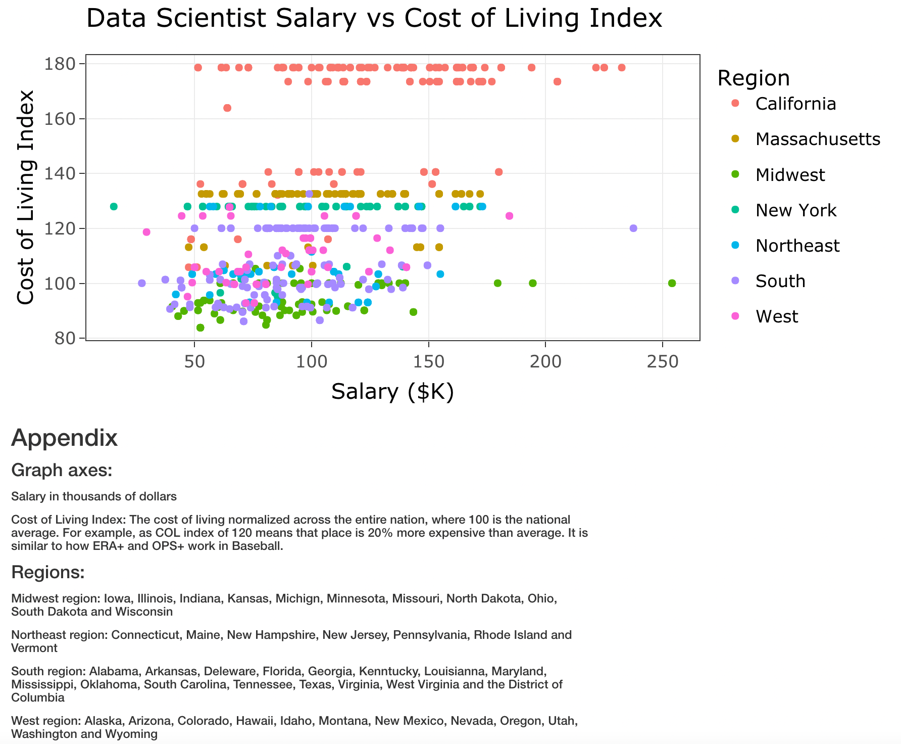
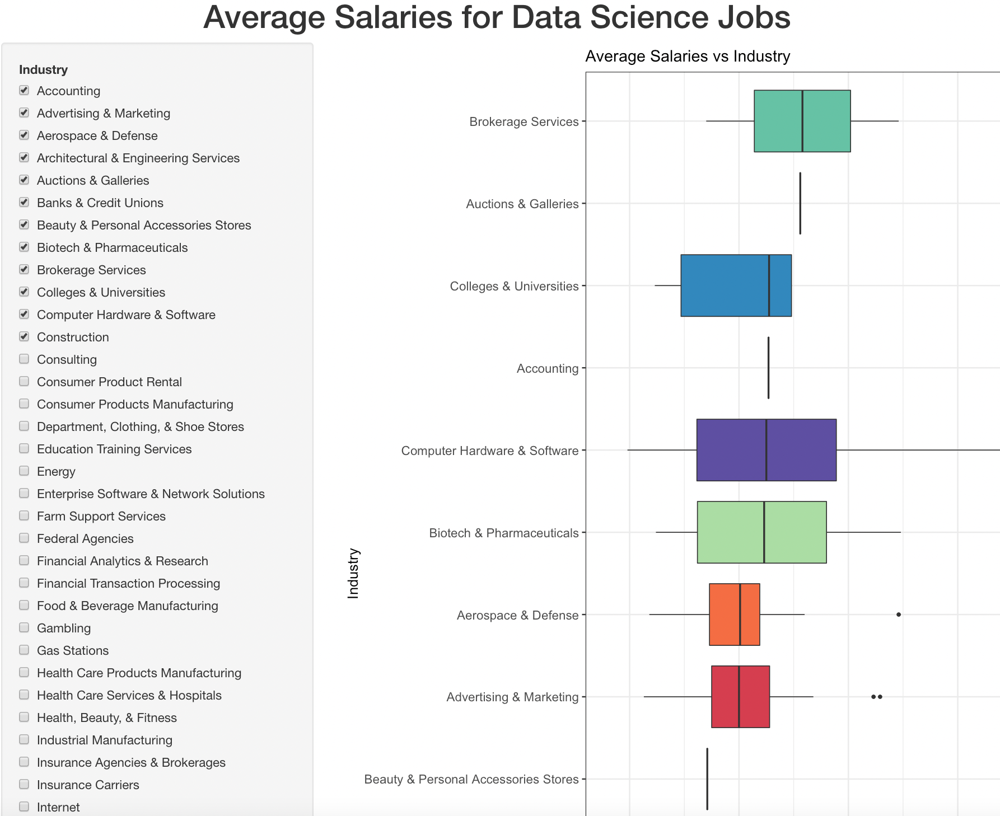
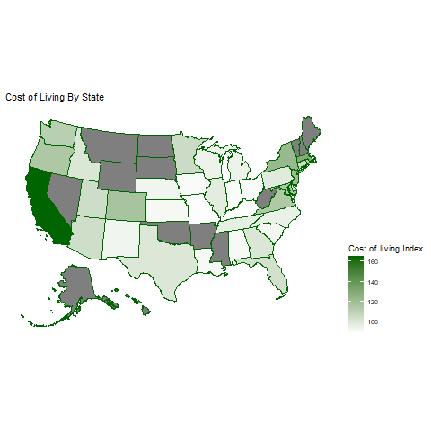

## Introduction

According to the US Department of Labor Statistics, as of May 2020, the current average salary of a data scientist is $100,560, indicating a monetarily successful profession. In order to understand, a set of questions as potential points of interest were developed, pertaining to which states have the highest paying jobs, what is the most optimal job in terms of net earnings and which industries and/or sectors have the highest paying jobs. The aim of this project is to visualize the state of this profession, providing aid in the decision making process for students thinking about becoming data scientists in the future and the current data scientists searching for the optimal position.

## Data

The data we used was scrapped from glassdoor, a review aggregation website of companies. Glassdoor allows users to anonymously rate companies, submit salaries and apply for jobs, all important for this project. The initial kaggle dataset is pre-cleaned and filtered, already containing information about salary, job descriptions and company ratings. After filtering out unwanted variables, removing those with missing data and mutating our columns, our newly processed data contains the Company Name, the city and state the job is located in, Rating, Industry, Sector, Job Title and two salary related columns: one with Average reported salary ranges and one with the calculated Average Salary based on the Salary Estimate. 

Additionally, we appended a column containing the cost of living index, obtaining the numbers from a secondary calculated dataset from AdvisorSmith, a small business analytics resource. The cost of living index takes the cost of living of a place and normalizes the number across the entire nation. Similar to how OPS+ works in baseball, AdvisorSmith adjusts the number on a scale where 100 represents the national average, meaning a cost of living index of 125 means that a place is 25% more expensive than an average place. As a result, this creates a standardized statistic that can be both easily grasped and visualized with.

While appending to our kaggle dataframe, a major hurdle occurs as AdvisorSmith only accounts for the major cities, not the suburbs found within their respective metropolitan areas. This is most prominently seen for jobs located in the San Francisco Bay Area, as we had to discard jobs located in cities such as Palo Alto, Foster City and Santa Clara. To solve this problem, we manually added a column in both our salary and cost of living datasets of the metropolitan area of each unique city using excel. As a result, it allows us to join the two based on the metropolitan area column, filling in the missing cost of living values of the suburbs. 

## Visualization 1: The most optimal data science job

The first visualization is a scatter plot that seeks to find the most optimal job in terms of salary and cost of living. It graphs the average reported salary for that specific job in that company on the x-axis and the cost of living index on the y-axis, creating a dynamic to where the ideal values are located towards the bottom right corner. Each point is colored by the region the job is based in, with the states of California, Massachusetts and New York defined as their own region. To add more interactivity for exploration and obtaining specific information about a point, a tooltip was added that brings up information regarding the specific point upon hover. Lastly, an appendix was added below the graph, defining the values of the axes and the specific states in each defined geographic region.

From the graph, a key observation is that there is no correlation between the two variables, with the points plotted seemingly randomly. This is slightly counterintuitive, as one would expect the salary to rise in conjunction with living costs. Additionally, all the jobs based in the San Francisco Bay Area are plotted along a straight line, well separated from the rest of the points. Lastly, the most bottomright and ideal point represents a job for a Director of Data Science in Chicago, indicating that the most ideal position is located in the Midwest.

The visualization subsequently pictured can be found by running the code in the ShinyAppSalvCOL.R file. 

## Visualization 2: What industries host the highest-paying data science jobs

In this visualization, we seek to answer the question of what industries/sectors provide the highest-paying data science related jobs. In this interactive visualization, users can select industries of their interest to view and compare their relative box plots in terms of average annual salary in thousands. Boxplots are ordered by descending median values.

Some findings from this visualization includes that data science jobs in financial analytics, telecommunication services, and brokerage are among the highest paying ones; while similar jobs in food and beverage manufacturing, architectural and engineering services, and social assistance industries are among the lowest paying ones.

The visualization subsequently pictured can be found by running the code in the app.R file. 

## Visualization 3: Costing of Living across the US

This third visualization is a map that uses a continuous scale to display the average cost of living. The color of the state is directly related to the cost of living. The states with the higher average cost of living become a darker shade of green and have a lighter, paler shade of green for a lower average cost of living. An important aspect of this visual is that the exact cost of living cannot be determined, but this visual is great for comparing the states to each other. There is a legend detailing the exact scale used in the visual. An important observation from the graph is the fact that particular states are missing color. We see this as a possible indicator that there aren’t any jobs of interest in those missing states or that a person is interested in data analytics or science. 

The visualization subsequently pictured can be found by running the code in the project_map.Rmd file. 

## Potential Improvements

In general, we plan on combining our interactive visualizations and the text of this document using a site to host it, such as observablehq or github pages. Additionally, since the document is running over the word count, we would like the reviewing group to suggest places to cut, condense or if anything needs to be expanded upon.

For visualization 1, we are potentially thinking about adding more options to filter the data, such as by sector, industry by a selectInput and rating via a sliderInput for example. However, we are not sure if it would be particularly useful, so some suggestions to what other interactive options someone would like to see would be useful feedback from the reviewing group.

For visualization 2, in the next draft, we plan to implement a facet plot by sectors and visualize each industry within their corresponding sectors. This way, it hopefully gives us a better understanding of the distribution of salaries from industries in each sector, as well as more detailed comparisons across sectors. In addition, we plan to also include a barplot option for users’ convenience.

For visualization 3, we are going to make it more interactive by having the exact cost of living, and possibly other information pop up when the mouse hovers over a given state. Another improvement would be including the information from missing states; however that is a problem with a dataset.

## Conclusion

After creating the visuals and reviewing them, working in the midwestern region of the country in financial analytics, telecommunication services, and brokerage is the best way to optimize personal finances when only considering cost of living, average salary, and industry of employment. On the other hand, we can conclude that living in California and working in social assistance or beverage manufacturing would leave someone with a minimal amount of money in their bank account. However, it is important to remember that this conclusion is only useful for the states we were able to collect data on.