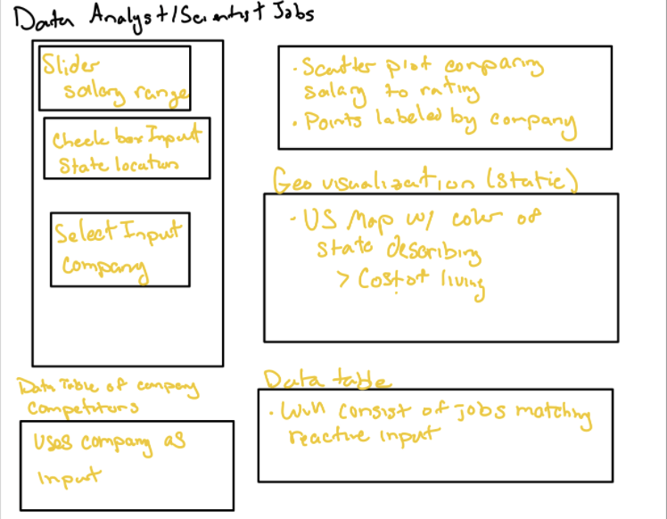
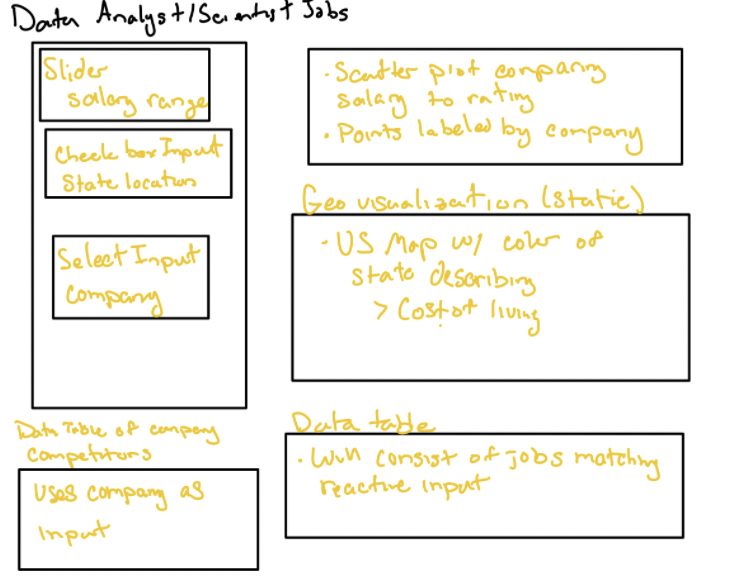
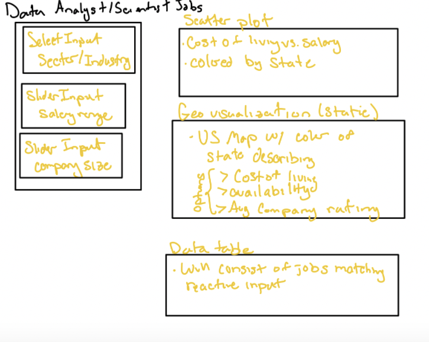

## Project Description

Through this visualization project, we have come up with a set of seven questions for which we identified potential points of interests and areas of use for our targeted audience. These are:

1. State vs salary: which states have the highest paying jobs

2. Industry vs salary: which industries (media, technology, finance for example) have the highest paying jobs

3. Sector vs salary: which sectors (healthcare, government, education) have the highest paying jobs

4. Job title vs salary: which positions earn the most money

5. Company rating vs average salary by company: do higher rated companies on glassdoor pay their workers more

6. Cost of living vs salary: what is the most optimal job in terms of net earnings

7. Comparisons with other similar jobs


## Data

The data we used was scrapped from glassdoor, a review aggregation website of companies. The website allows users to anonymously rate companies, submit salaries and apply for jobs, all important for this project. (Source: wikipedia) The initial kaggle dataset is pre-cleaned and filtered, already containing information about salary, job descriptions and company ratings. After filtering out unwanted variables, removing those with missing data and mutating our columns, our newly processed data contains the Company Name, the city and state the job is located in, Rating, Industry, Sector, Job Title and two salary related columns: one with Average reported salary ranges and one with the calculated Average Salary based on the Salary Estimate. (the latter is still to be implemented)

Additionally, we appended a column containing the cost of living index, obtaining the numbers from a secondary calculated dataset from AdvisorSmith. While appending, a major hurdle occurs as AdvisorSmith only accounts for the major cities, not the suburbs found within their respective metropolitan areas. This is most prominently seen for jobs located in the San Francisco Bay Area, as we had to discard jobs located in cities such as Palo Alto, Foster City and Santa Clara. Ultimately, this resulted in around 44% of the initial downloaded dataset being discarded, something that needs to be rectified in the near future.

## Sketches of data visualization

Below are the 3 sketches for the App. The main factors that we are looking to visualize are salary and cost of living.







## Appendix

```{r}
library(readr)
library(tidyverse)
library(ggplot2)
library(shiny)
library(shinyWidgets)
```

## Data reading and cleaning

```{r}
# Read in data
ds_sal = read_csv("https://uwmadison.box.com/shared/static/l2n9u9d97yxzibvd71y7a370kt0pj1pu.csv")
costoliv = read_csv("https://uwmadison.box.com/shared/static/6xphn35fqqq8svwr3y9iis1cpxjqfo8b.csv")

# Sneak Preview
head(ds_sal)
names(ds_sal)
head(costoliv)
names(costoliv)

# Separating Location into City and State
ds_salfix = ds_sal %>%
  separate(Location, c('City','State'),sep = ', ') #ignore warning, will be fixed in next line
ds_salfix[127,]$City = 'Los Angeles'
ds_salfix[127,]$State = 'CA'

# Filtering columns to our desired variables
ds_salfix = ds_salfix[,c(1:3,5:8,13:14,19:21)]
ds_salfix$cost.of.living = NA #empty column

# Appending Cost of Living onto dataframe
for(i in seq(length(ds_salfix$City))){
  if (ds_salfix[i,]$City %in% costoliv$City) {
    ix = which(costoliv$City == ds_salfix[i,]$City)
    for (j in ix){
      if(ds_salfix[i,]$State == costoliv[j,]$State){
        # print(i)
        # print(ds_salfix[i,]$City)
        # print(j)
        # print(costoliv[j,]$State)
        # print(ds_salfix[i,]$cost.of.living)
        ds_salfix[i,]$cost.of.living = costoliv[j,]$`Cost of Living Index`
      }
    }
  }
}
```

## Short Visualization 1 of Average Salary vs Cost of living:

```{r, , fig.width=7.5, fig.height=7.5}
ds_salfix %>%
  drop_na(cost.of.living) %>%
  ggplot() +
  geom_point(aes(`Avg Salary(K)`, cost.of.living, col = State)) +
  labs(
    x = "Average Salary (K)",
    y = "Cost of Living Index",
    color = "State"
  )
```

This short, non-dynamic visualization plots the relationship between average salary and cost of living. A simple observation is that most of the points a plopped under an average salary of $150,000 and cost of living index of 140, many California points are located near the cost of living index of 180 and our desired jobs that maximizes pay and minimizes the cost of living index are found within the state of Illinois (persumably Chicago)

## Short Visualization 2 

```{r}
ds_salfix <- ds_salfix %>% 
  rename(Avg.Salary.K = 'Avg Salary(K)',
         Job.Title = 'Job Title') %>% 
  mutate(Avg.Salary.K = as.numeric(Avg.Salary.K))

# Boxplot
box = function(salary, x){    
  # salary = filter(salary, selected == TRUE)
  ggplot(salary) +
    geom_boxplot(aes(x = "Avg Salary(K)", 
                     y = x,
                     fill=x)) +
    theme(legend.position="bottom") + 
    labs(title= "Boxplot of Average Salaries", 
         x= "Average Salary (K)",
         y= x)
}

ui = fluidPage(
  titlePanel(h1("Average Salaries for Data Science Jobs", align = "center")),
  inputPanel(
    selectInput("x_var", "Select a variable that you want to compare average salaries", 
                c("State" = "State", "Job Title" = "Job.Title"), selected = "State")
  ),
  mainPanel(plotOutput("boxplot"))
)

server = function(input, output){
  output$boxplot = renderPlot({box(ds_salfix, input$x_var)})
}

app <- shinyApp(ui, server)

app
```

For this visualization, we created a shiny app which allows the user to select an x variable to compare average salaries. At this stage, we offer two choices: State and Sector. After choosing the desired x variable, the user will be able to view a box plot that shows the average salary of data science related jobs in thousands being compared across that variable.